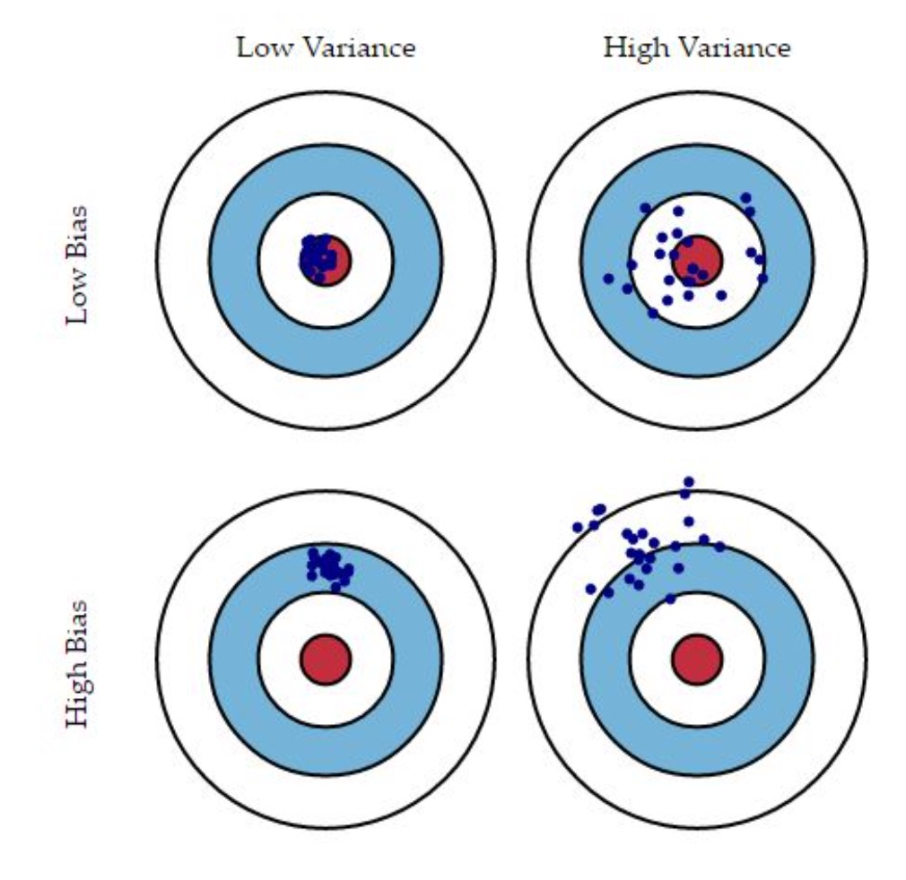

 # Bias Variance Trade-Off

 * The bias-variance trade-off is the point where we are adding just noise by adding model complexity (flexibility)
 * The training error goes down, but the test error will start to go off at some point. (overfitting)

Sometimes we will get a good distribution of training data so we predict very well, but sometimes, we might be getting a training data that is full of outliers or non-standard values resulting in poor predictions.  

Common temptation for beginners is to continually add complexity to a model until it fits the traning set very well.

* Doing this can cause overfitting, which can cause large errors on the test set.
* We want to mitigate this by finding the right balance point between *bias* and *variance*  

