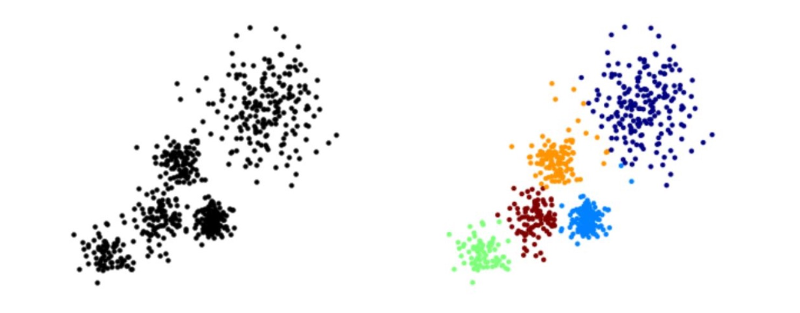
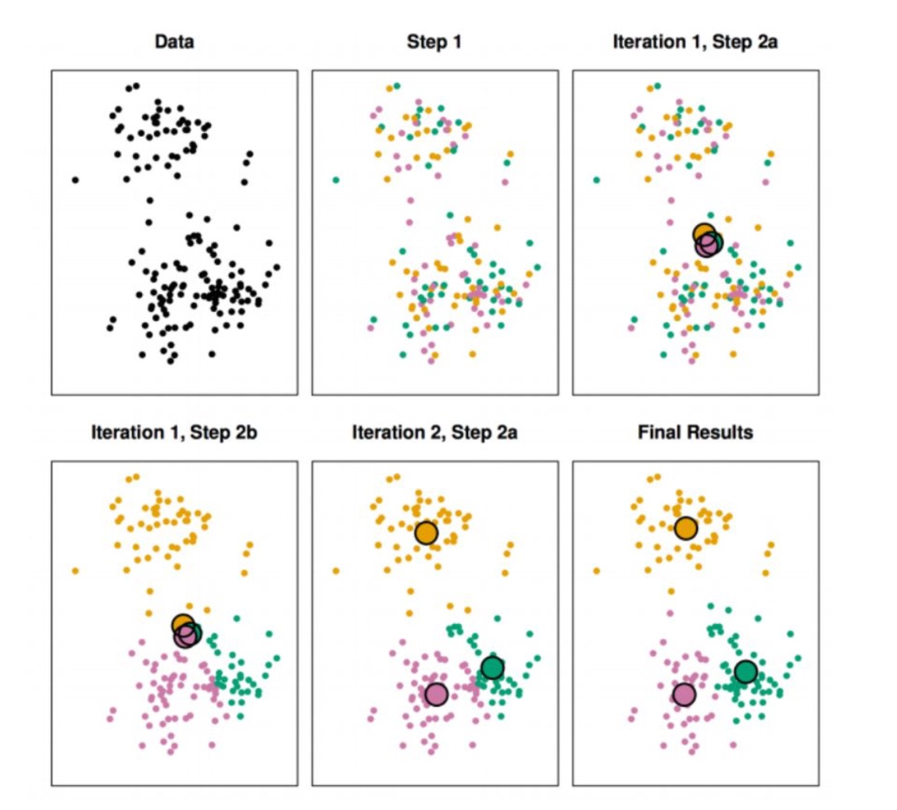
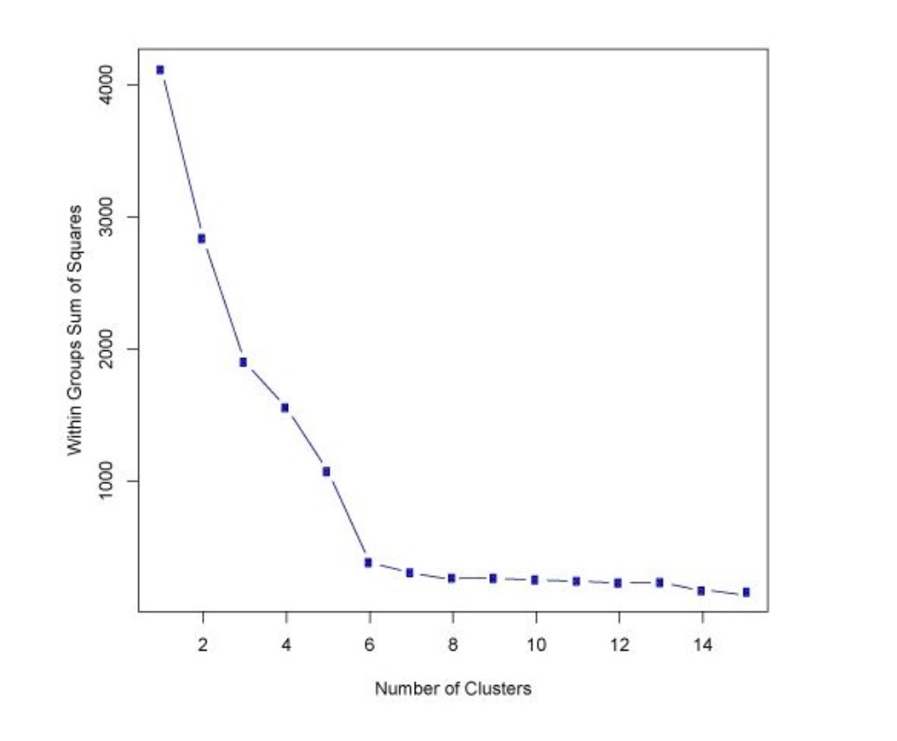

# K Means Clustering

K Means Clustering is an **unsupervised** leanring algorithm that will attempt to group similar clusters together in data.

**Typical Clustering Problem**:

* Cluster Similar Documents
* Cluster Customers based on Features
* Market Segmentation
* Identify similar physical groups

### Algorithm
1. Choose a number of Clusters "*K*"
2. Randomly assign each point to a cluster
3. Until clusters stop changing, repeat the following:
  * For each cluster, compute the cluster centroid by taking the mean vector of points in the cluster
  * Assign each data point to the cluster for which the centroid is the closest.
 

## Choosing *K* Values

So how do we choose *K*?

* There is no easy way to choose 
* One way is the *elbow* method.
	* First of all, compute the sum of squared error (SSE) for some values of *k*. (2, 4, 6, 8, etc.)
	* SSE is defined as the sum of the squared distance between each member of the cluster and its centroid.

Plotting *k* against the SSE, we can see that the error **decreases** as *k* gets **larger**. This is because when the number of clusters increases, distortion becomes smaller. (since clusters are smaller)

The idea of the elbow method is to choose the *k* at which the SSE decreases **abruptly**. 

This produces an "elbow effect" in the graph. 

In this case, the ideal number of *k* is **6 or 7**.
