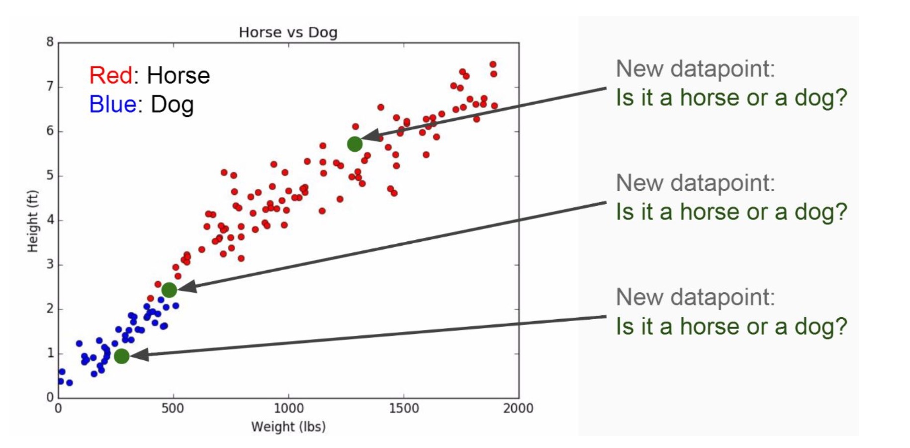
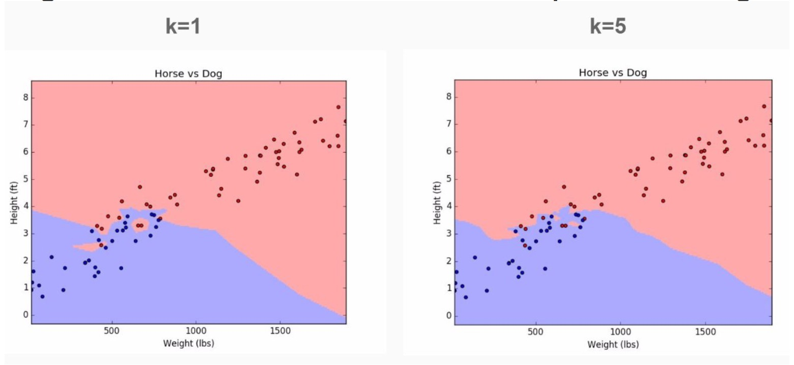
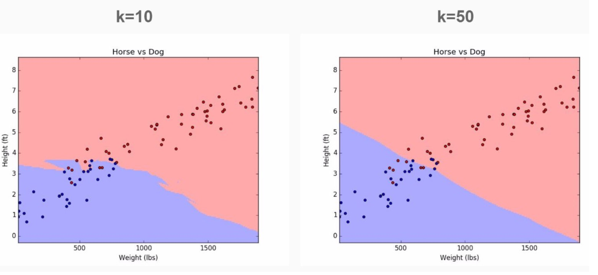

# K Nearest Neighbors

K Nearest Neighbors is a **classification** algorithm that operates on a very simple principle.  

**Training Algorithm**: Store all data. 

**Prediction Algorithm:**  
1. Calculate the distance from *x* to all points in data.  
2. Sort the points by increasing distance from *x*.   
3. Predict the majority label of the ***k*** closest points

**Example diagram**:  

Choosing the ***k*** value will affect what class a new point is assigned to. 

\* A lot of noise for smaller *k* values. 

### Pros
* Simple
* Training is trivial
* Works with any number of classes
* Easy to add data
* Few parameters (*k*, distance metric)

### Cons
* High Prediction Cost (Worse for large data)
* Not good with high dimensional data
* Categorical features don't work well.