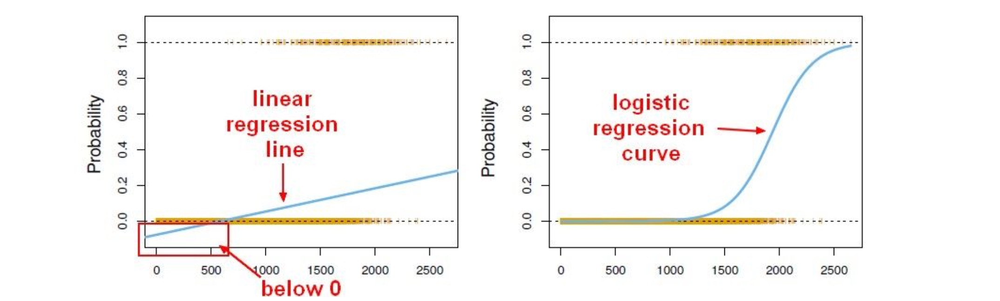
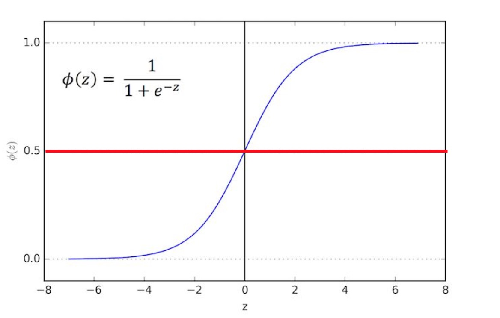

# Logistic Regression  

### Background
Logistic Regression is a method for classification.  

* Examples (Binary Classifications)
  * Spam vs. Ham emails
  * Loan Default (yes/no)
  * Diesase Diagnosis

We can't use a linear regression model on a train set like the loan default example. (May lead to predicting probabilities below 0%) 
Instead, we use a logistic regression curve.
  

### Sigmoid Function

The sigmoid function takes in **any value** and outputs it to be between 0 and 1.
   

The value of *z* does not matter. This means, that we can take the Linear Regression solution and place it into the Sigmoid Function.

This results in a probability from 0 to 1 in the *1* class. We can set a cutoff point, with anything below resulting in class 0, and anything above in class 1.

### Model Evaluation

After we train a logistic regression model on some training data, we use a **confusion matrix** to evaluate our model.

**Basic Terminology:**  
* True Positives (TP)
* True Negatives (TN)
* False Positives (FP)
* False Negatives (FN)

*Accuracy* (How often is it correct?) : (TP + TN) / total  
*Misclassification Rate* (Error Rate): (FP + FN) / total

