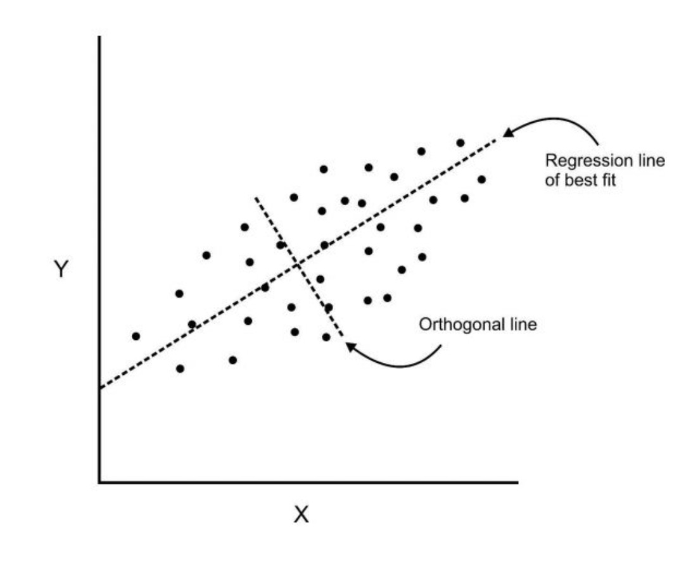
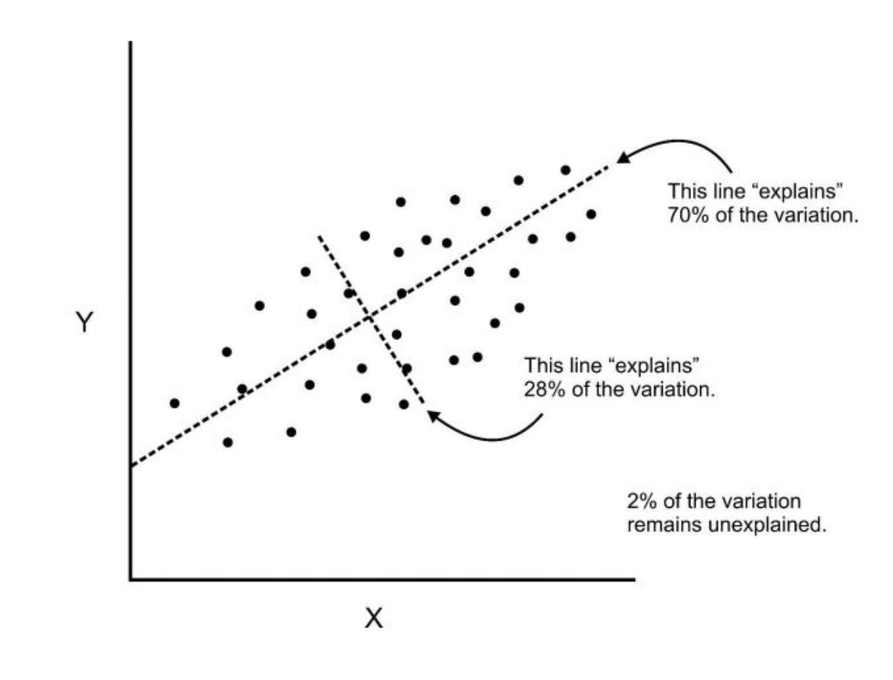
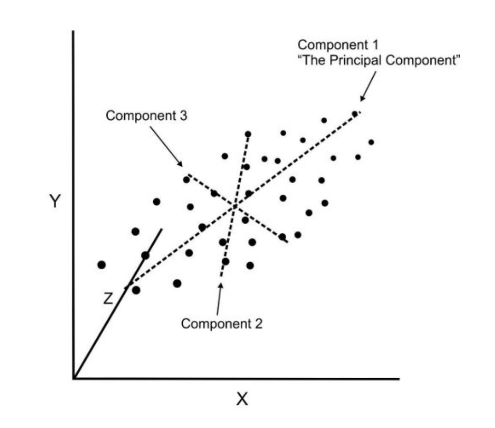

# Principal Component Analysis

## Background
PCA is an ***unsupervised*** statistical technique used to examine the interrelations among a set of variables in order to identify the underlying structure of those variables. It is also known as a general factor analysis.

Whereas regression determines a line of best fit to a data set, factor analysis determines several orthogonal lines of best fit.

* Lines are perpendicular to each other in n-dimensional space.
* n-dimensional space is the variable sample space.
  * There are as many dimensions as there are variables, so in a data set with 4 variables the sample space is 4-dimensional.

**Components** are a linear transformation that chooses a variable system for the data set such that the greatest variance of the data set comes to lie on the first axis.

And the second greatest variance on the second axis, and so on... This allows us to reduce the number of variables used in analysis.

If we use this technique on a data set with a large number of variables, we can compress the amount of explained variation to just a few components, but the most challenging part is interpreting the components.

However, this technique is not deployment-ready and is mainly used for data analysis.