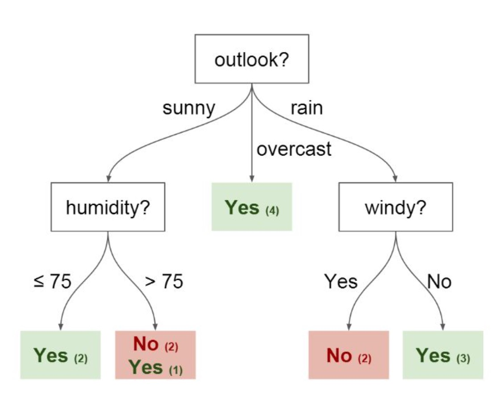
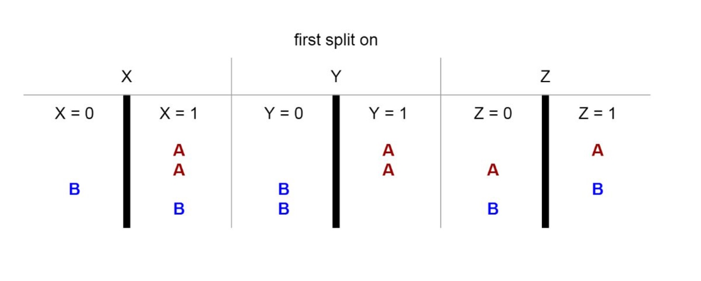
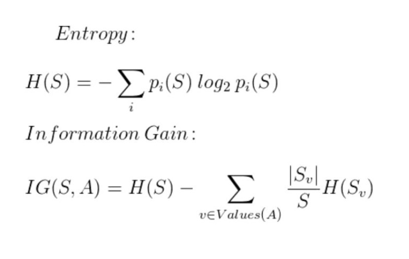

# Tree Methods
Chapter 8 of **Introduction to Statistical Learning** by [*Gareth James, et al.*](http://www-bcf.usc.edu/~gareth/ISL/)

Additional [blogpost](https://medium.com/towards-data-science/enchanted-random-forest-b08d418cb411) explaining decision trees and rft's.

### Why the Tree Methods?
---
Imagine that I play Tennis every Saturday and I always invite a friend to play with me. Sometimes he shows up, sometimes not. For him, it depends on a variety of factors like *weather, temperature, humidity, wind, etc.* I start keeping track of these **features** and whether or not he shows up.

## Decision Trees
In the tree, we have: 
 
* Nodes   
  * Split for the value of a certain attribute    
* Edges  
  * Outcome of a split to next node  

In the example above, we have: 
 
* Root   
  * Split for the value of a certain attribute  
* Edges   
  * Outcome of a split to next node

We could split certain features first:  

**Entropy** and **Information Gain** are the mathematical methods of choosing the best split. We are ultimately trying to choose the features that best split our data. (maximizing information gain)

## Random Forests
The primary weakness of decision trees is that they don't have the best predictive accuracy due to high variance. (Different splits in training data can lead to very different trees)

**Bagging** is a general purpose procedure to reduce variance. We can build off on the idea of *bagging* by utilizing *random forests*. 

***Random forests***: Ensemble of decision trees using *bootstrapped samples** of training set.  
*samples from the training set with replacement

When building each tree, each time a split is considered, a random sample of *m* features is chosen as a split candidate from the full set of *p* features. The split is only allowed to use 1 of those *m* features. A new random sample of features is chosen for every single tree for every single split. For classification, *m* is typically chosen to be the **square root of** ***p***.

### What's the point?
---
Suppose there is **one very strong feature** in the dataset. When using "bagged" trees, most of the trees will use that feature as the top split, resulting in an ensemble of similar trees that are **highly correlated**.

* Averaging highly correlated quantities does not significantly reduce variance.
* By randomly leaving out candidate features from each split, random forests **"decorrelate"** (make independent of each other) the trees, such that the averaging process can reduce the variance of the resulting model.

